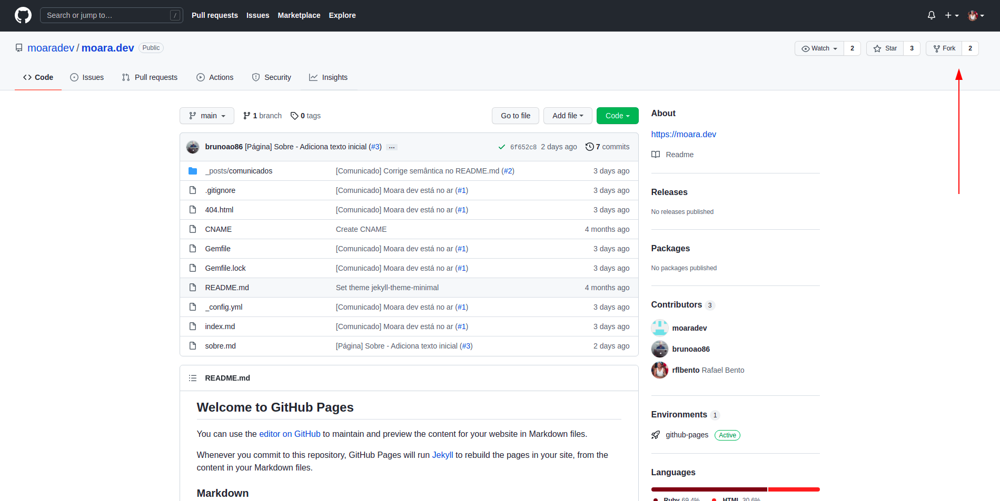
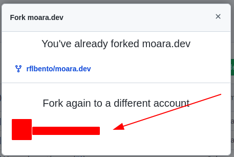
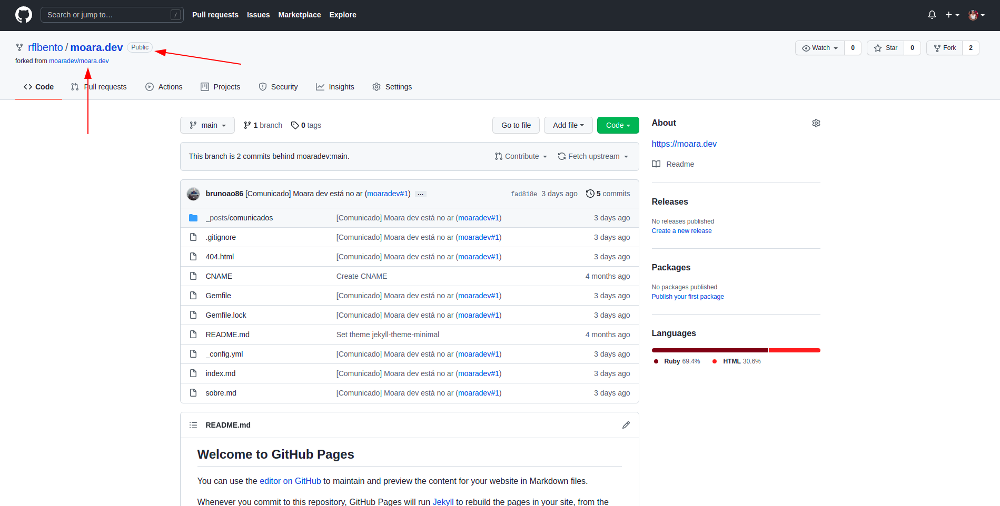
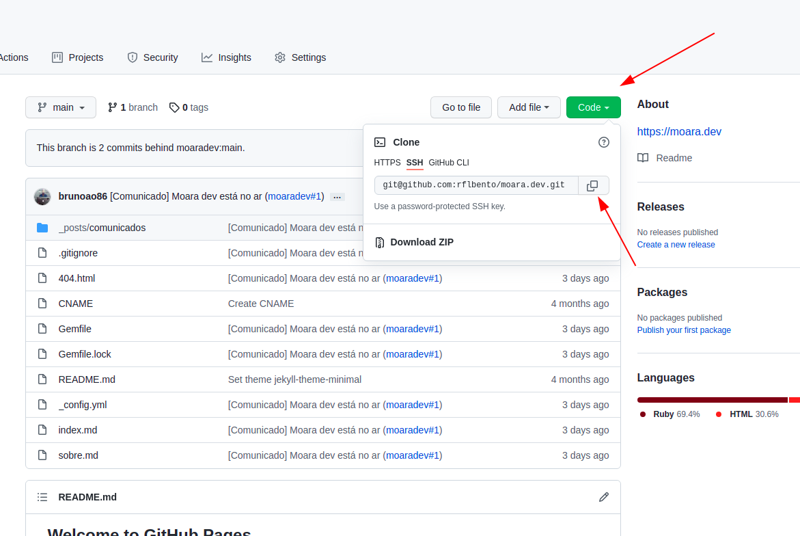

Se você chegou até aqui, imagino que tenha vontade de contribuir com o
projeto, mas é bem possível que esteja se perguntando: como posso ter
acesso ao repositório e participar dessa construção?

É mais simples do que você imagina! Bora abrir nosso primeiro PR?

# O Fork

O primeiro passo para trabalharmos com projetos públicos é "*forkear*" um
repositório, ou seja, "clonar" um projeto para o seu próprio perfil.

Então para fazermos este processo aqui no **moara.dev**, vamos acessar o
[repositório no Github](https://github.com/moaradev/moara.dev) e clicarmos
no botão "**Fork**", localizado no canto superior direito, como demonstrado
na imagem abaixo:

Após clicar no botão, será aberta uma modal onde deve selecionar o perfil no
qual deseja "*forkear*" o projeto, conforme imagem abaixo:

:rotating_light: *Aviso!* :rotating_light:

*No meu caso eu já havia clonado o projeto, por isso consta a mensagem*
*"You've alreadry forked moara.dev"*

Após selecionar o perfil no qual terá o uma cópia do projeto, perceberá que
agora terá um repositório "**moara.dev**" vinculado ao seu perfil e com menção
ao projeto original, conforme demonstra a imagem abaixo:

# Clonando localmente

Agora que possuímos uma cópia fiel do projeto, podemos seguir o procedimento de
clonar o repositório localmente, portanto basta abrir o terminal em sua máquina,
acessar a pasta na qual deseja clonar seu projeto e digitar
`git clone <LINK_DO_REPOSITORIO>`

(Exemplo: `git clone git@github.com:rflbento/moara.dev.git`)

### LINK_DO_REPOSITORIO

Este link mencionado você encontra conforme feito na imagem abaixo, onde clico em
"*Code*", seleciono a opção "SSH" (se esta já não vier selecionada) e clico no botão
que copia o link:

[Em construção...]
